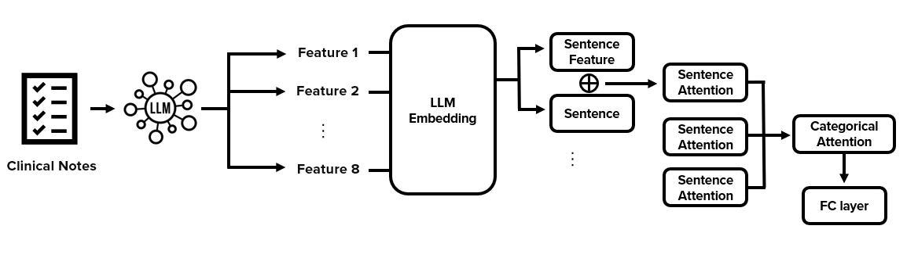
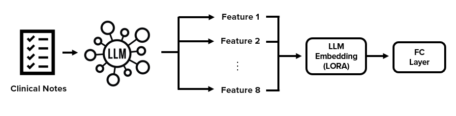
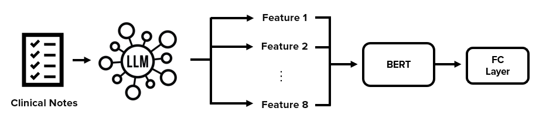
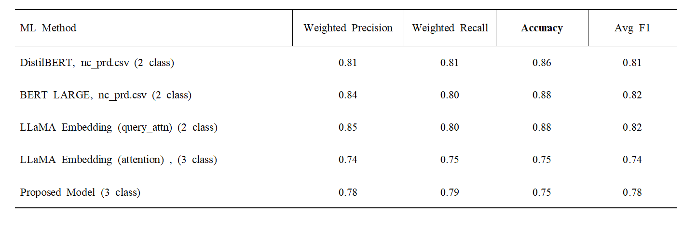
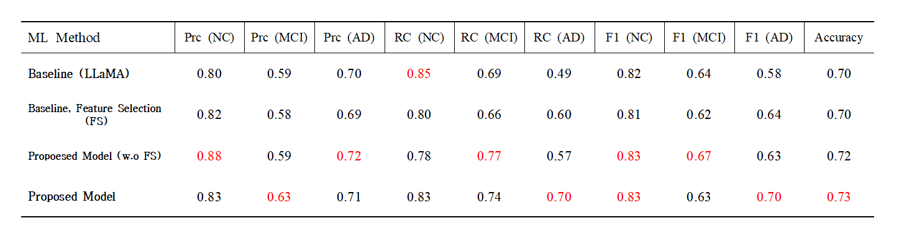
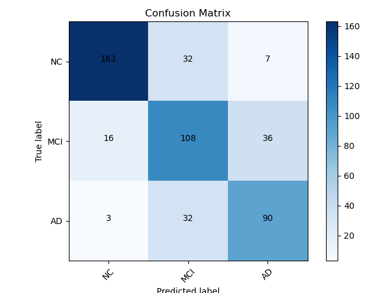

# 🧠 LLM 기반 AD/MCI/NC 진단 알고리즘 개발

본 프로젝트는 임상 노트 기반의 대규모 언어 모델(LLM)을 활용하여 알츠하이머(AD), 경도인지장애(MCI), 정상(NC)을 분류하는 **다중 분류 예측 알고리즘**을 개발한 연구입니다.

- 🏥 **지원기관:** 단국대학교 병원  
- 🧪 **소속 연구실:** C&I Lab (Communication & Intelligence Lab)  
- 📅 **진행 기간:** 2024.10 ~ 2025.03  

 

## 🔧 모델 구조 및 구성 비교

### 1️⃣ 제안 모델 (Proposed Model)  
LLM 기반 임베딩 후, 각 문장 피처와 어텐션 구조를 계층적으로 적용하여 최종 분류를 수행합니다.

---

 
 

### 2️⃣ LoRA 기반 LLM 임베딩 모델  
LoRA(Low-Rank Adaptation)를 적용하여 임베딩을 최적화하고, FC Layer를 통해 분류합니다.

---
 
 

### 3️⃣ BERT 기반 비교 모델  
LLM으로부터 추출한 피처를 BERT에 입력하여 분류하는 비교 실험 모델입니다.

---
 
 

## 📊 성능 비교 지표

### 🔢 다양한 모델의 성능 비교 (2-class & 3-class)  

---

 
 

### 🎯 클래스 별 정밀도 및 재현율 (NC, MCI, AD)

---

 
 

## 📉 Confusion Matrix  

- **NC:** 정상  
- **MCI:** 경도인지장애  
- **AD:** 알츠하이머병  

---

 
 

## 🛠 사용 기술 스택

- Language Models: LLaMA, BERT, DistilBERT
- Optimization: LoRA, Attention Mechanisms
- Programming: Python, PyTorch
- Evaluation Metrics: Accuracy, Precision, Recall, F1-score
- Visualization: Matplotlib, Seaborn

---

 
 

## 📂 프로젝트 구조
- 각 Branch에 각 모델들 있음

---

 
 

## 👨‍💻 연구 기여자
- **임석범 (Seokbeom Lim)** – 환경 설계, 모델 개발, 분석  
- **이승재 (Seungjae Lee)** – LLM을 이용한 feature 추출
- **윤종우 (JongWoo Yoon)** – BERT, Ko-BERT 모델 개발

---

 
 

## 📂 Conference

Kyu-haeng Lee, Seokbeom Lim, Ilju Lee, Ok Kim, Hyun Woo Jung, Sehwan Kim, Hee Jung Kim, Keunsoo Kang, and Jung Jae Lee, "Dementia Prediction Using Hierarchical Attention and Evaluation of Context Quality," Alzheimer’s Association International Conference (AAIC) 2025.

---

